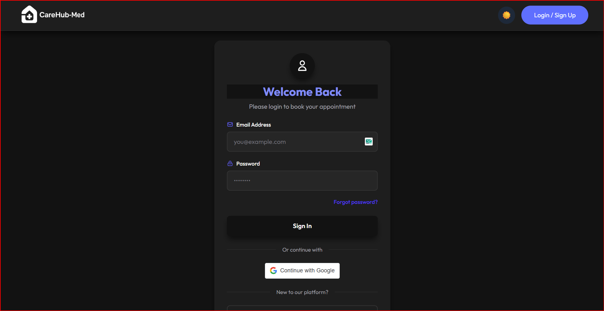
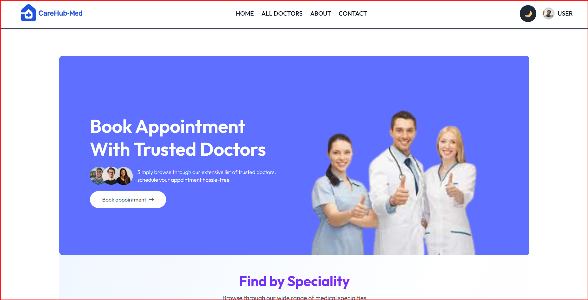
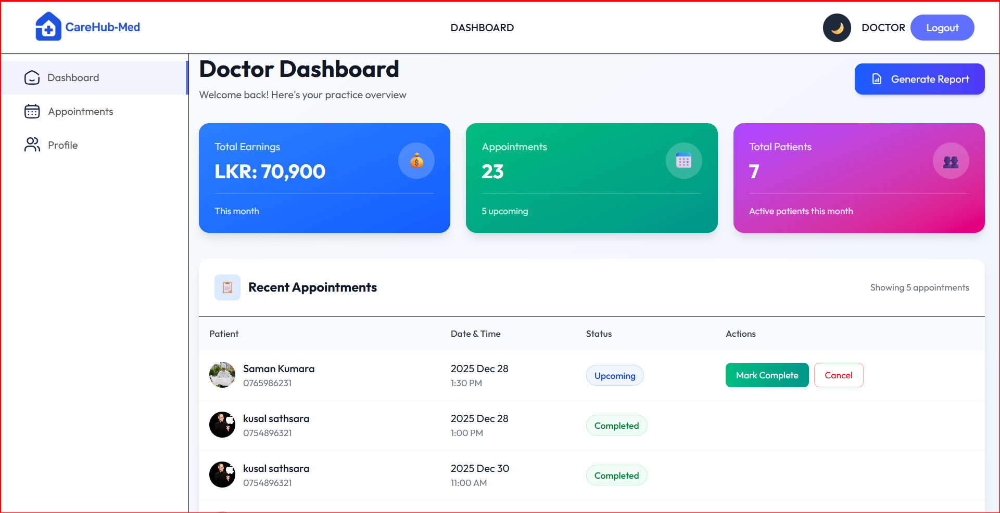
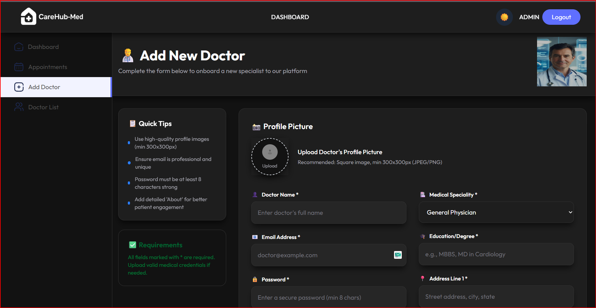
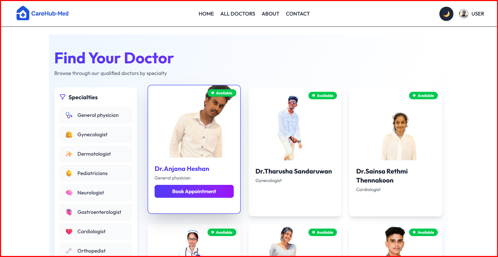
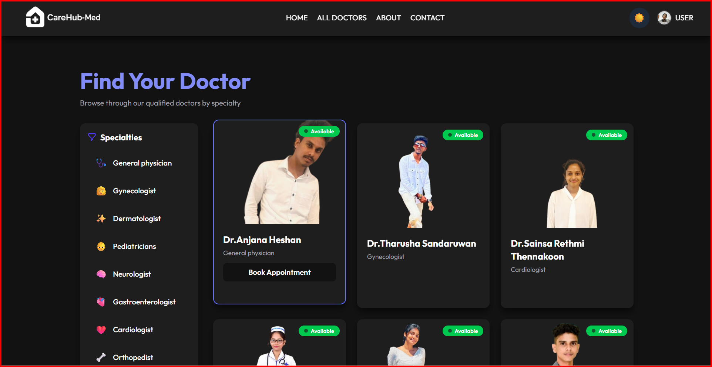
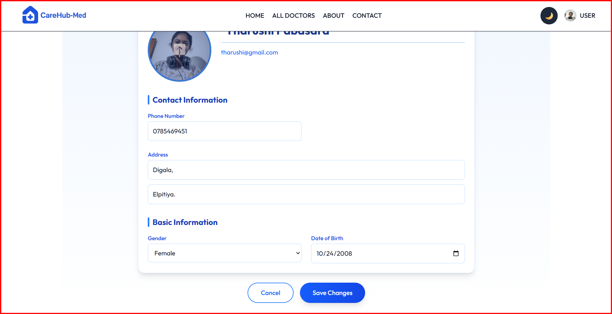
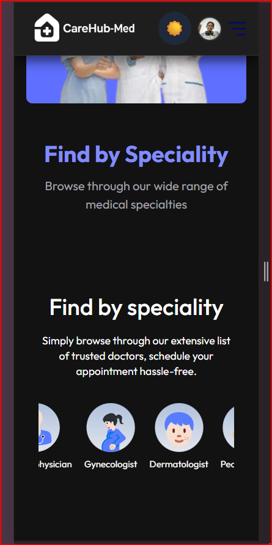

<!-- # 🏥 CareHub Med

> A modern, full-featured medical appointment management system built with React, TypeScript, and Vite


CareHub Med is a comprehensive healthcare appointment management platform that streamlines the booking process for patients, provides powerful dashboards for doctors, and gives administrators complete oversight of the entire system.

## ✨ Features

### 🔐 Authentication & Security
- **JWT Token Authentication** with automatic refresh token handling
- Secure role-based access control (Patient(users), Doctor, Admin)
- Protected routes and API endpoints

### 👥 Patient Features
- Browse and book appointments with specialized doctors
- Select preferred time slots
- Cancel appointments with automatic notifications
- Receive email confirmations for all appointment actions
- Real-time appointment status updates
- View appointment history
- View and edit Profile
- Contact with care hub med hospitalilty
- Brows web site before registration

### 👨‍⚕️ Doctor Dashboard
- Comprehensive dashboard with key metrics:
  - Monthly salary overview
  - Total patient count
  - Upcoming appointments
  - completed and cancelled appointment deatails
- Manage appointments (view, complete, cancel)
- Real-time email notifications for new bookings
- Download appointment reports as PDF
- Track latest appointment details

### 🔧 Admin Panel
- System-wide appointment overview across all doctors
- Monitor and manage all appointments
- Cancel missed appointments after scheduled date
- Access detailed analytics and reports
- Download comprehensive PDF reports
- View real-time appointment statistics

### 🎨 User Experience
- **Dark Mode & Light Mode** toggle for comfortable viewing
- Responsive design for all devices
- Intuitive and modern UI/UX
- Real-time updates without page refresh
- Sweet alert for confirmations
- toest alert for othe notification

### 📧 Email Notifications
Automated email system that notifies users for:
- Appointment confirmation (booking)
- Appointment cancellation
- Appointment completion
- Real-time updates to doctors and patients

### 📊 Reporting
- Generate detailed appointment reports
- Download reports as PDF
- Export functionality for record-keeping

## 🚀 Tech Stack

### Frontend
- **React 18.x** - UI library
- **TypeScript** - Type safety and better developer experience
- **Vite** - Lightning-fast build tool and dev server
- **React Router** - Client-side routing
- **Axios** - HTTP client with interceptors for token refresh
- **Tailwind CSS** - Utility-first styling (assumed)
- **React Query/SWR** - Data fetching and caching (recommended)
- **Sweet Alert** - To confirmations
- **Toest Alert** - For other notifications

### Build Tools
- **Vite** - Fast HMR and optimized production builds
- **ESLint** - Code quality and consistency
- **TypeScript Compiler** - Type checking

## 📦 Installation

### Prerequisites
- Node.js (v18 or higher)
- npm or yarn
- Backend API running (see backend repository)

### Setup

1. **Clone the repository**
```bash
git clone https://github.com/Anjana-Hesh/CareHub-Med.git
cd carehub-med
```

2. **Install dependencies**
```bash
npm install
# or
yarn install
```

3. **Configure environment variables**
```bash
cp .env.example .env
```

Edit `.env` with your configuration:
```env
VITE_API_BASE_URL=http://localhost:5000/api
VITE_APP_NAME=CareHub Med
```

4. **Start development server**
```bash
npm run dev
# or
yarn dev
```

The application will be available at `http://localhost:5173`

## 🏗️ Project Structure

```
carehub-med/
├── public/              # Static assets
├── src/
│   |
│   ├── assets/         # Images, fonts, icons
│   ├── components/     # Reusable components
│   │   ├── Banner.tsx/ 
│   │   ├── Footer.tsx/ 
│   │   ├── Header.tsx/ 
|   |   |__ Navbar.tsx/
|   |   |__ RelatedDoctors.tsx/
|   |   |__ SideBar.tsx/
|   |   |__ SpecialityMenu.tsx/
|   |   |__ TopDoctors.tsx/
│   ├── contexts/       # React context providers       # Layout components
│   ├── pages/          # Page components
│   │   ├── admin/
|   |   |   |__ AddDoctors.tsx/
|   |   |   |__ AdminDashboard.tsx/
|   |   |   |__ AllAppointments.tsx/
|   |   |   |__ DoctorsList.tsx/   
│   │   ├── doctor/
|   |   |   |__ Dashboard.tsx/
|   |   |   |__ DoctorAppointment.tsx/
|   |   |   |__ DoctorProfile.tsx/
│   │   ├── About.tsx/  
│   │   └── Appointment.tsx/
|   |   |__ Contact.tsx/
|   |   |__ Doctor.tsx/
|   |   |__ ForgetPassword.tsx/
|   |   |__ Home.tsx/
|   |   |__ Login.tsx/
|   |   |__ MyAppointment.tsx/
|   |   |__ MyProfile.tsx/
|   |   |__ ResetPassword.tsx/
│   ├── services/       # Business logic
|   |   |__ admin.ts
|   |   |__ api.ts
|   |   |__ auth.ts
|   |   |__ doctor.ts
│   ├── App.tsx         # Root component
│   └── main.tsx        # Entry point
├── .env.example        # Environment variables template
├── eslint.config.js    # ESLint configuration
├── tsconfig.json       # TypeScript configuration
├── vite.config.ts      # Vite configuration
└── package.json        # Dependencies
```

## 🔑 Key Features Implementation

### Token Authentication with Auto-Refresh
```typescript
// Axios interceptor automatically refreshes expired tokens
axios.interceptors.response.use(
  (response) => response,
  async (error) => {
    if (error.response?.status === 401) {
      // Auto-refresh token logic
      const newToken = await refreshAccessToken();
      // Retry original request
    }
  }
);
```

### Real-time Email Notifications
- Integrated with backend email service
- Sends notifications on appointment events
- Templates for different notification types

### PDF Report Generation
- Client-side PDF generation using `jspdf` or `react-pdf`
- Customizable report templates
- Download functionality for all reports

### Theme Management
```typescript
// Dark/Light mode toggle with persistence
const [theme, setTheme] = useState<'light' | 'dark'>('light');
// Stored in localStorage and applied to root element
```

## 🛠️ Available Scripts

```bash
# Development
npm run dev          # Start dev server with HMR

# Build
npm run build        # Type-check and build for production
npm run preview      # Preview production build locally

# Code Quality
npm run lint         # Run ESLint
npm run type-check   # Run TypeScript compiler check
```

## 🔒 Security Features

- JWT token storage in httpOnly cookies (recommended) or secure localStorage
- Automatic token refresh before expiration
- CSRF protection
- Input validation and sanitization
- Role-based route protection
- XSS prevention

## 🎯 User Roles & Permissions

### Patient
✅ Book appointments  
✅ Cancel own appointments  
✅ View appointment history  
✅ Receive email notifications  

### Doctor
✅ View dashboard with analytics  
✅ Manage appointments  
✅ Complete/cancel appointments  
✅ Download reports  
✅ View salary information  

### Admin
✅ System-wide overview  
✅ Manage all appointments  
✅ Cancel missed appointments  
✅ Generate system reports  
✅ Monitor all doctors and patients  

## 📱 Responsive Design

CareHub Med is fully responsive and optimized for:
- 📱 Mobile devices (320px and up)
- 📱 Tablets (768px and up)
- 💻 Desktops (1024px and up)
- 🖥️ Large screens (1440px and up)

## 🤝 Contributing

Contributions are welcome! Please follow these steps:

1. Fork the repository
2. Create a feature branch (`git checkout -b feature/AmazingFeature`)
3. Commit your changes (`git commit -m 'Add some AmazingFeature'`)
4. Push to the branch (`git push origin feature/AmazingFeature`)
5. Open a Pull Request

## 📄 License

This project is licensed under the MIT License - see the [LICENSE](LICENSE) file for details.

## 👨‍💻 Author

**Your Name**
- GitHub: [@Anjana-Hesh](https://github.com/Anjana-Hesh)
- LinkedIn: [Anjana Heshan](https://www.linkedin.com/in/anjana-heshan-79334b260/?originalSubdomain=lk)

## 🙏 Acknowledgments

- React team for the amazing library
- Vite team for the blazing-fast build tool
- All contributors and supporters of this project

## 📞 Support

For support, email support@carehubmed.com or join our Slack channel.

---

**Made with ❤️ for better healthcare management** -->


# 🏥 CareHub Med

<div align="center">


### A Modern Healthcare Appointment Management System

[](https://reactjs.org/)
[](https://www.typescriptlang.org/)
[](https://vitejs.dev/)
[](https://tailwindcss.com/)

</div>

---

## 📋 Table of Contents

- [Overview](#-overview)
- [Screenshots](#-screenshots)
- [Features](#-features)
- [Tech Stack](#-tech-stack)
- [Getting Started](#-getting-started)
- [Project Structure](#-project-structure)
- [Key Implementations](#-key-implementations)
- [User Roles](#-user-roles--permissions)
- [Security](#-security-features)
- [Contributing](#-contributing)
- [License](#-license)
- [Contact](#-contact)

---

## 🌟 Overview

**CareHub Med** is a comprehensive healthcare appointment management platform designed to revolutionize the way patients, doctors, and administrators interact with medical scheduling. Built with modern web technologies, it provides a seamless experience across all devices with real-time updates and intelligent automation.

### Why CareHub Med?

- 🚀 **Lightning Fast** - Built with Vite for optimal performance
- 🔐 **Secure** - JWT authentication with automatic token refresh
- 📧 **Smart Notifications** - Automated email system for all appointment events
- 📊 **Data-Driven** - Generate and download PDF reports instantly
- 🎨 **Beautiful UI** - Modern interface with dark/light mode support
- 📱 **Responsive** - Seamless experience on any device

---

## 📸 Screenshots

### 👤 Loging page
<div align="center">
  
  <p><em>Login page</em></p>
</div>

### 🏠 Landing Page & Home
<div align="center">
  
  <p><em>Modern landing page with intuitive navigation</em></p>
</div>

### 👨‍⚕️ Doctor Dashboard
<div align="center">
  
  <p><em>Comprehensive doctor dashboard with analytics</em></p>
</div>

### 🔧 Admin Panel
<div align="center">
  
  <p><em>System-wide overview and management</em></p>
</div>

### 📅 Appointment Booking
<div align="center">
  
  <p><em>Easy appointment scheduling with time slot selection</em></p>
</div>

### 🌙 Dark Mode
<div align="center">
  
  <p><em>Eye-friendly dark mode for comfortable viewing</em></p>
</div>

### 📅 My Profile
<div align="center">
  
  <p><em>My profile</em></p>
</div>

### 📱 Mobile Responsive
<div align="center">
  
  <p><em>Fully responsive design for mobile devices</em></p>
</div>

---

## ✨ Features

### 🔐 Authentication & Security
- 🔑 **JWT Token Authentication** with automatic refresh mechanism
- 🛡️ **Role-Based Access Control** (Patient, Doctor, Admin)
- 🔒 **Protected Routes** and secure API endpoints
- 🚪 **Password Reset** functionality via email

### 👥 Patient/User Features
- 🔍 **Browse Doctors** by speciality before registration
- 📅 **Book Appointments** with preferred time slots
- ❌ **Cancel Appointments** with instant notifications
- 📧 **Email Confirmations** for all appointment actions
- 🔔 **Real-Time Updates** on appointment status
- 📜 **Appointment History** tracking
- 👤 **Profile Management** (view and edit)
- 📞 **Contact Hospital** directly through the platform

### 👨‍⚕️ Doctor Dashboard
- 📊 **Comprehensive Analytics:**
  - 💰 Monthly salary overview
  - 👥 Total patient count
  - 📅 Upcoming appointments
  - ✅ Completed appointments
  - ❌ Cancelled appointments
- 🎯 **Appointment Management** (view, complete, cancel)
- 📧 **Real-Time Email Notifications** for new bookings
- 📄 **Download Reports** as PDF
- 📈 **Latest Appointment Tracking**
- 👤 **Profile Management**

### 🔧 Admin Panel
- 🌐 **System-Wide Overview** across all doctors
- 📊 **Monitor All Appointments** in real-time
- ❌ **Cancel Missed Appointments** after scheduled dates
- 📈 **Detailed Analytics** and insights
- 📄 **PDF Report Generation** for comprehensive data
- 👨‍⚕️ **Doctor Management** (add, edit, view)
- 📊 **Real-Time Statistics** dashboard

### 🎨 User Experience
- 🌓 **Dark Mode & Light Mode** with persistent preference
- 📱 **Fully Responsive** design for all devices
- 🎯 **Intuitive UI/UX** with modern design patterns
- ⚡ **Real-Time Updates** without page refresh
- 🍬 **Sweet Alert** for confirmations
- 🔔 **Toast Notifications** for instant feedback
- 🎭 **Smooth Animations** and transitions

### 📧 Email Notification System
Automated email alerts for:
- ✅ Appointment confirmation (booking)
- ❌ Appointment cancellation
- ✔️ Appointment completion
- 🔔 Real-time notifications to doctors and patients
- 🔐 Password reset links

### 📊 Reporting & Analytics
- 📈 **Generate Detailed Reports** with key metrics
- 📄 **Download as PDF** for record-keeping
- 📊 **Export Functionality** for data analysis
- 📉 **Visual Analytics** with charts and graphs

---

## 🚀 Tech Stack

### Frontend Framework & Libraries

| Technology | Purpose | Version |
|------------|---------|---------|
|  | UI Library | 18.x |
|  | Type Safety | 5.x |
|  | Build Tool | 6.x |
|  | Routing | Latest |
|  | HTTP Client | Latest |
|  | Styling | 3.x |

### Additional Libraries
- **Sweet Alert 2** - Beautiful confirmation dialogs
- **React Toastify** - Toast notifications
- **jsPDF** / **React-PDF** - PDF generation
- **React Query** / **SWR** - Data fetching & caching
- **Date-fns** / **Day.js** - Date manipulation
- **React Hook Form** - Form management
- **Zod** - Schema validation

### Build & Development Tools
- **Vite** - Lightning-fast HMR and optimized builds
- **ESLint** - Code quality and consistency
- **TypeScript Compiler** - Static type checking
- **Prettier** - Code formatting

---

## 🚀 Getting Started

### Prerequisites

Before you begin, ensure you have the following installed:

- **Node.js** (v18 or higher) - [Download](https://nodejs.org/)
- **npm** or **yarn** - Package manager
- **Git** - Version control
- **Backend API** - Running instance (see [backend repository](https://github.com/yourusername/carehub-backend))

### Installation Steps

1. **Clone the Repository**

```bash
git clone https://github.com/Anjana-Hesh/CareHub-Med.git
cd CareHub-Med
```

2. **Install Dependencies**

```bash
npm install
# or
yarn install
# or
pnpm install
```

3. **Configure Environment Variables**

Create a `.env` file in the root directory:

```bash
cp .env.example .env
```

Edit `.env` with your configuration:

```env
VITE_API_BASE_URL=http://localhost:5000/api
VITE_APP_NAME=CareHub Med
VITE_APP_VERSION=1.0.0
```

4. **Start Development Server**

```bash
npm run dev
# or
yarn dev
```

The application will be available at `http://localhost:5173` 🎉

5. **Build for Production**

```bash
npm run build
# or
yarn build
```

6. **Preview Production Build**

```bash
npm run preview
# or
yarn preview
```

---

## 🏗️ Project Structure

```
CareHub-Med/
├── 📁 public/                      # Static assets
│   ├── logo.png
│   └── favicon.ico
│
├── 📁 screenshots/                 # Application screenshots
│   ├── home-page.png
│   ├── user-dashboard.png
│   ├── doctor-dashboard.png
│   └── ...
│
├── 📁 src/
│   ├── 📁 assets/                  # Images, fonts, icons
│   │   ├── images/
│   │   ├── icons/
│   │   └── fonts/
│   │
│   ├── 📁 components/              # Reusable UI components
│   │   ├── Banner.tsx              # Hero banner component
│   │   ├── Footer.tsx              # Footer component
│   │   ├── Header.tsx              # Header component
│   │   ├── Navbar.tsx              # Navigation bar
│   │   ├── RelatedDoctors.tsx      # Related doctors section
│   │   ├── SideBar.tsx             # Sidebar navigation
│   │   ├── SpecialityMenu.tsx      # Speciality filter menu
│   │   └── TopDoctors.tsx          # Top doctors section
│   │
│   ├── 📁 contexts/                # React Context providers
│   │   ├── AuthContext.tsx         # Authentication state
│   │   ├── ThemeContext.tsx        # Theme management
│   │   └── AppContext.tsx          # Global app state
│   │
│   ├── 📁 pages/                   # Page components
│   │   ├── 📁 admin/               # Admin panel pages
│   │   │   ├── AddDoctors.tsx      # Add new doctor
│   │   │   ├── AdminDashboard.tsx  # Admin overview
│   │   │   ├── AllAppointments.tsx # All appointments view
│   │   │   └── DoctorsList.tsx     # Manage doctors
│   │   │
│   │   ├── 📁 doctor/              # Doctor pages
│   │   │   ├── Dashboard.tsx       # Doctor dashboard
│   │   │   ├── DoctorAppointment.tsx # Appointment management
│   │   │   └── DoctorProfile.tsx   # Doctor profile
│   │   │
│   │   ├── About.tsx               # About page
│   │   ├── Appointment.tsx         # Book appointment
│   │   ├── Contact.tsx             # Contact page
│   │   ├── Doctor.tsx              # Browse doctors
│   │   ├── ForgetPassword.tsx      # Password recovery
│   │   ├── Home.tsx                # Landing page
│   │   ├── Login.tsx               # Login page
│   │   ├── MyAppointment.tsx       # User appointments
│   │   ├── MyProfile.tsx           # User profile
│   │   └── ResetPassword.tsx       # Reset password
│   │
│   ├── 📁 services/                # API service layer
│   │   ├── admin.ts                # Admin API calls
│   │   ├── api.ts                  # Base API configuration
│   │   ├── auth.ts                 # Authentication services
│   │   └── doctor.ts               # Doctor API calls
│   │
│   ├── 📁 types/                   # TypeScript type definitions
│   │   ├── user.types.ts
│   │   ├── appointment.types.ts
│   │   └── doctor.types.ts
│   │
│   ├── 📁 utils/                   # Utility functions
│   │   ├── auth.ts                 # Token management
│   │   ├── pdf.ts                  # PDF generation
│   │   ├── theme.ts                # Theme utilities
│   │   └── helpers.ts              # Helper functions
│   │
│   ├── 📁 hooks/                   # Custom React hooks
│   │   ├── useAuth.ts
│   │   ├── useTheme.ts
│   │   └── useAppointments.ts
│   │
│   ├── App.tsx                     # Root component
│   ├── main.tsx                    # Entry point
│   └── index.css                   # Global styles
│
├── .env.example                    # Environment template
├── .gitignore                      # Git ignore rules
├── eslint.config.js                # ESLint configuration
├── tsconfig.json                   # TypeScript config
├── tsconfig.node.json              # Node TypeScript config
├── vite.config.ts                  # Vite configuration
├── tailwind.config.js              # Tailwind configuration
├── postcss.config.js               # PostCSS configuration
├── package.json                    # Dependencies
├── README.md                       # This file
└── LICENSE                         # MIT License
```

---

## 🔑 Key Implementations

### 🔐 Token Authentication with Auto-Refresh

```typescript
// services/api.ts
import axios from 'axios';

const api = axios.create({
  baseURL: import.meta.env.VITE_API_BASE_URL,
  withCredentials: true,
});

// Request interceptor to add token
api.interceptors.request.use(
  (config) => {
    const token = localStorage.getItem('accessToken');
    if (token) {
      config.headers.Authorization = `Bearer ${token}`;
    }
    return config;
  },
  (error) => Promise.reject(error)
);

// Response interceptor for token refresh
api.interceptors.response.use(
  (response) => response,
  async (error) => {
    const originalRequest = error.config;

    if (error.response?.status === 401 && !originalRequest._retry) {
      originalRequest._retry = true;

      try {
        const refreshToken = localStorage.getItem('refreshToken');
        const { data } = await axios.post('/auth/refresh', { refreshToken });
        
        localStorage.setItem('accessToken', data.accessToken);
        originalRequest.headers.Authorization = `Bearer ${data.accessToken}`;
        
        return api(originalRequest);
      } catch (refreshError) {
        // Redirect to login
        window.location.href = '/login';
        return Promise.reject(refreshError);
      }
    }

    return Promise.reject(error);
  }
);

export default api;
```

### 📧 Real-time Email Notifications

The backend integration handles:
- Appointment booking confirmations
- Cancellation notifications
- Completion confirmations
- Doctor notification for new appointments
- Custom email templates with appointment details

### 📄 PDF Report Generation

```typescript
// utils/pdf.ts
import jsPDF from 'jspdf';
import 'jspdf-autotable';

export const generateAppointmentReport = (appointments: Appointment[]) => {
  const doc = new jsPDF();
  
  // Add title
  doc.setFontSize(18);
  doc.text('Appointment Report', 14, 22);
  
  // Add table
  doc.autoTable({
    head: [['Date', 'Patient', 'Doctor', 'Status']],
    body: appointments.map(apt => [
      apt.date,
      apt.patientName,
      apt.doctorName,
      apt.status
    ]),
    startY: 30,
  });
  
  // Download
  doc.save('appointment-report.pdf');
};
```

### 🌓 Theme Management

```typescript
// contexts/ThemeContext.tsx
import { createContext, useState, useEffect } from 'react';

export const ThemeContext = createContext({
  theme: 'light',
  toggleTheme: () => {},
});

export const ThemeProvider = ({ children }) => {
  const [theme, setTheme] = useState<'light' | 'dark'>(() => {
    return localStorage.getItem('theme') || 'light';
  });

  useEffect(() => {
    localStorage.setItem('theme', theme);
    document.documentElement.classList.toggle('dark', theme === 'dark');
  }, [theme]);

  const toggleTheme = () => {
    setTheme(prev => prev === 'light' ? 'dark' : 'light');
  };

  return (
    <ThemeContext.Provider value={{ theme, toggleTheme }}>
      {children}
    </ThemeContext.Provider>
  );
};
```

### 🍬 Alert System

```typescript
// Using Sweet Alert 2
import Swal from 'sweetalert2';

export const confirmCancellation = async () => {
  const result = await Swal.fire({
    title: 'Cancel Appointment?',
    text: "You won't be able to revert this!",
    icon: 'warning',
    showCancelButton: true,
    confirmButtonColor: '#d33',
    cancelButtonColor: '#3085d6',
    confirmButtonText: 'Yes, cancel it!'
  });
  
  return result.isConfirmed;
};

// Using React Toastify
import { toast } from 'react-toastify';

export const showSuccessToast = (message: string) => {
  toast.success(message, {
    position: "top-right",
    autoClose: 3000,
  });
};
```

---

## 🛠️ Available Scripts

```bash
# Development
npm run dev              # Start dev server with HMR (Hot Module Replacement)
npm run dev -- --host    # Expose dev server to network

# Building
npm run build            # Type-check and build for production
npm run build:dev        # Build for development environment

# Preview
npm run preview          # Preview production build locally

# Code Quality
npm run lint             # Run ESLint to check code quality
npm run lint:fix         # Fix ESLint errors automatically
npm run type-check       # Run TypeScript compiler check
npm run format           # Format code with Prettier

# Testing (if configured)
npm run test             # Run unit tests
npm run test:watch       # Run tests in watch mode
npm run test:coverage    # Generate coverage report
```

---

## 🔒 Security Features

### 🛡️ Authentication & Authorization
- ✅ **JWT Tokens** - Secure token-based authentication
- 🔄 **Automatic Token Refresh** - Seamless session management
- 🔐 **Refresh Token Rotation** - Enhanced security
- 🚪 **Secure Logout** - Clear all auth data

### 🔒 Data Protection
- ✅ **HttpOnly Cookies** - Recommended for token storage
- ✅ **CSRF Protection** - Cross-Site Request Forgery prevention
- ✅ **XSS Prevention** - Cross-Site Scripting mitigation
- ✅ **Input Validation** - Client and server-side validation
- ✅ **Sanitization** - Clean user inputs

### 👤 Access Control
- ✅ **Role-Based Access Control (RBAC)** - Patient, Doctor, Admin roles
- ✅ **Protected Routes** - Authenticated access only
- ✅ **Permission Checks** - Feature-level authorization
- ✅ **Route Guards** - Prevent unauthorized navigation

### 📝 Password Security
- ✅ **Password Reset Flow** - Secure email-based reset
- ✅ **Strong Password Requirements** - Enforce complexity
- ✅ **Hashed Passwords** - Backend bcrypt hashing

---

## 🎯 User Roles & Permissions

### 👥 Patient/User Role

| Feature | Permission |
|---------|-----------|
| Browse doctors before registration | ✅ Allowed |
| Register/Login | ✅ Allowed |
| Book appointments | ✅ Allowed |
| Cancel own appointments | ✅ Allowed |
| View appointment history | ✅ Allowed |
| Edit profile | ✅ Allowed |
| Receive email notifications | ✅ Automatic |
| Contact hospital | ✅ Allowed |

### 👨‍⚕️ Doctor Role

| Feature | Permission |
|---------|-----------|
| View personal dashboard | ✅ Allowed |
| View analytics (salary, patients) | ✅ Allowed |
| Manage appointments | ✅ Allowed |
| Complete appointments | ✅ Allowed (after date) |
| Cancel appointments | ✅ Allowed |
| Download reports (PDF) | ✅ Allowed |
| Edit profile | ✅ Allowed |
| Receive email notifications | ✅ Automatic |

### 🔧 Admin Role

| Feature | Permission |
|---------|-----------|
| System-wide dashboard | ✅ Allowed |
| View all appointments | ✅ Allowed |
| Add new doctors | ✅ Allowed |
| Manage doctors list | ✅ Allowed |
| Cancel any appointment | ✅ Allowed (after missed date) |
| Generate system reports | ✅ Allowed |
| Download PDF reports | ✅ Allowed |
| View analytics | ✅ Allowed |

---

## 📱 Responsive Design

CareHub Med is fully optimized for all screen sizes:

| Device | Breakpoint | Features |
|--------|------------|----------|
| 📱 **Mobile** | 320px - 767px | Touch-optimized UI, hamburger menu |
| 📱 **Tablet** | 768px - 1023px | Adaptive layouts, collapsible sidebar |
| 💻 **Desktop** | 1024px - 1439px | Full sidebar, multi-column layouts |
| 🖥️ **Large Desktop** | 1440px+ | Expanded content, enhanced visuals |

---

## 🤝 Contributing

We welcome contributions from the community! Here's how you can help:

### How to Contribute

1. **Fork the Repository**
   ```bash
   git clone https://github.com/Anjana-Hesh/CareHub-Med.git
   ```

2. **Create a Feature Branch**
   ```bash
   git checkout -b feature/AmazingFeature
   ```

3. **Make Your Changes**
   - Write clean, documented code
   - Follow existing code style
   - Add tests if applicable

4. **Commit Your Changes**
   ```bash
   git commit -m 'Add some AmazingFeature'
   ```

5. **Push to the Branch**
   ```bash
   git push origin feature/AmazingFeature
   ```

6. **Open a Pull Request**
   - Provide a clear description
   - Link any related issues
   - Wait for review

### Contribution Guidelines

- 📝 Follow the existing code style
- ✅ Ensure all tests pass
- 📖 Update documentation
- 🐛 Report bugs via [Issues](https://github.com/Anjana-Hesh/CareHub-Med/issues)
- 💡 Suggest features via [Discussions](https://github.com/Anjana-Hesh/CareHub-Med/discussions)

---

## 📄 License

This project is licensed under the **MIT License** - see the [LICENSE](LICENSE) file for details.

```
MIT License

Copyright (c) 2024 Anjana Heshan

Permission is hereby granted, free of charge, to any person obtaining a copy
of this software and associated documentation files (the "Software"), to deal
in the Software without restriction...
```

---

## 👨‍💻 Author & Contact

<div align="center">

### Anjana Heshan

**Full Stack Developer**

[](https://github.com/Anjana-Hesh)
[](https://www.linkedin.com/in/anjana-heshan-79334b260/?originalSubdomain=lk)
[](mailto:anjanaheshan@gmail.com)
[](https://your-portfolio.com)

</div>

---

## 🙏 Acknowledgments

Special thanks to:

- 🚀 **React Team** - For the amazing UI library
- ⚡ **Vite Team** - For the blazing-fast build tool
- 🎨 **Tailwind CSS** - For the utility-first CSS framework
- 💙 **TypeScript Team** - For type safety and better DX
- 🌟 **Open Source Community** - For inspiration and support
- 👥 **All Contributors** - Who helped make this project better

---

## 📞 Support & Feedback

Need help or have suggestions?

- 📧 **Email:** support@carehubmed.com
- 💬 **Discord:** [Join our server](https://discord.gg/your-server)
- 🐛 **Issues:** [GitHub Issues](https://github.com/Anjana-Hesh/CareHub-Med/issues)
- 💡 **Feature Requests:** [GitHub Discussions](https://github.com/Anjana-Hesh/CareHub-Med/discussions)
- 📖 **Documentation:** [Read the Docs](https://your-docs-link.com)

---

## 🗺️ Roadmap

### Current Version (v1.0.0)
- ✅ Core appointment management
- ✅ Email notification system
- ✅ PDF report generation
- ✅ Dark/Light mode
- ✅ Responsive design

### Upcoming Features (v2.0.0)
- 🔄 Video consultation integration
- 💳 Payment gateway integration
- 📊 Advanced analytics dashboard
- 🌐 Multi-language support
- 📱 Mobile app (React Native)
- 🔔 Push notifications
- 💬 In-app messaging
- 📅 Calendar sync (Google, Outlook)

---

## 📊 Project Stats

<div align="center">


</div>

---

<div align="center">

### ⭐ Star this repository if you found it helpful!

**Made with ❤️ and ☕ for better healthcare management**


---

**CareHub Med** © 2024 - Revolutionizing Healthcare Appointments

[🏠 Back to Top](#-carehub-med)

</div>